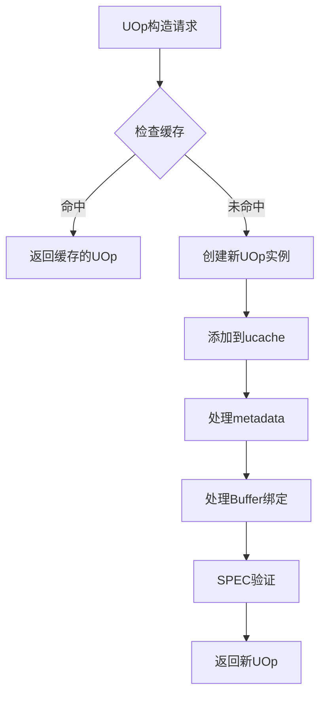

在 `tinygrad` 的架构中，`UOp`（Micro-Operation，微算子）和 `Ops` 是整个框架的**灵魂**。如果说 `DType` 是数据的物理外壳，那么 `UOp` 就是计算的物理实体。

以下是对这两个类的深度解读：

---

## 1. 核心定义：什么是 UOp？

UOp（统一操作）图系统是tinygrad中的核心中间表示。它将所有计算——从高层张量操作到设备特定指令——表示为有向无环图（DAG）。该系统支持统一的优化流水线，变换以声明式图重写形式表达。

在 tinygrad 中，**一切皆 UOp**。无论是一个常量、一个加法运算、还是一个复杂的计算图，在底层都会被统一表示为一个 `UOp` 对象。

### `Ops` 类（操作符枚举）

`Ops` 定义了 tinygrad 能够理解的所有基础原子操作。它通常分为几类：

- **UnaryOps (单目)**: `NEG`, `EXP2`, `LOG2`, `SIN` 等。
    
- **BinaryOps (双目)**: `ADD`, `MUL`, `MAX`, `CMPLT` 等。
    
- **ReduceOps (归约)**: `SUM`, `MAX`。
    
- **MovementOps (移动)**: `RESHAPE`, `PERMUTE`, `PAD`, `STRIDE`。
    
- **Load/StoreOps**: `LOAD`, `STORE`, `CONST`。
    

### `UOp` 类（计算节点）

`UOp` 是计算图中的一个节点。它的核心结构包含：

- **op**: 属于 `Ops` 中的哪一种。
    
- **dtype**: 该运算结果的数据类型。
    
- **src**: 该节点的输入（由其他 `UOp` 组成的元组）。
    
- **arg**: 该节点的额外参数（如 `CONST` 的具体数值，或 `RESHAPE` 的新形状）。
    

---

## 2. 设计哲学：计算即图转换 (Rewriting)

tinygrad 的作者 Geohot 认为，传统的深度学习框架（如 PyTorch）在算子融合优化上做得太重、太复杂。`UOp` 的设计哲学是：**将一切表示为简单的树状/图结构，然后通过“重写规则”进行极致优化。**

### 1) 声明式 vs 命令式

在 PyTorch 中，`a + b` 是立即执行或记录在 autograd 中。 在 tinygrad 中，`a + b` 会创建一个新的 `UOp(Ops.ADD, dtype, (a, b))`。这仅仅是一个**声明**，计算并没有发生。

### 2) 极致的算子融合 (Operator Fusion)

因为整个计算逻辑都被统一成了 `UOp` 树，编译器可以非常轻松地观察到：

> `(x * 2) + 1` → 这是一个 `MUL` 后面接一个 `ADD`。 编译器会自动将其重写为一个 `FMA` (Fused Multiply-Add) 指令，而不需要昂贵的中间内存读写。

### 3) 规范化 (Canonicalization)

`UOp` 的构造函数会自动进行简单的优化。例如：

- `x + 0` 自动返回 `x`。
    
- `x * 1` 自动返回 `x`。
    
- `CONST(2) + CONST(3)` 自动在编译期折叠为 `CONST(5)`。
    

---

## 3. UOp 的生命周期

理解 `UOp` 就能理解 tinygrad 是如何工作的：

1. **Frontend (前端)**: 用户写 `Tensor([1,2]) + 1`。
    
2. **LazyStack (延迟堆栈)**: 转化为一系列 `UOp`。此时图非常深，且包含很多冗余。
    
3. **Optimizer (优化器)**: 通过简单的模式匹配（Pattern Matching），将复杂的 `UOp` 树重写为更高效的等价形式。
    
4. **Backend (后端)**: 优化后的 `UOp` 树被送到不同的 Renderer（渲染器），翻译成 OpenCL, CUDA, 或 C 代码。
    

---

## 4. 为什么这么设计？

### 优点：

- **跨平台极简**：如果你想支持一个新的 AI 芯片，你只需要写一个 Renderer，将 `UOp` 映射到该芯片的汇编即可。你不需要重新实现复杂的自动求导或内存管理。
    
- **可数学证明的优化**：`UOp` 的重写过程本质上是代数化简。这比 PyTorch 那种黑盒式的算子融合更容易调试和预测性能。
    

### 与 `DType` 的关系：

`DType` 决定了 `UOp` 在执行时的比特宽度。比如一个 `Ops.ADD` 类型的 `UOp`，如果其 `dtype` 是 `float16`，Renderer 就会生成对应半精度浮点数的加法指令。

---

## 总结

- **`Ops`** 是动作的**列表**（做什么）。
    
- **`UOp`** 是动作的**实例**（谁对谁做了什么）。
    

在 tinygrad 中，**“程序”就是一棵由 `UOp` 组成的树**。tinygrad 的核心工作就是不断地通过代数法则，把这棵“大而烂”的树，修剪成一棵“小而美”的树，最后翻译给显卡执行。


---
# 继承关系：

## 1. `Ops` 继承自 `FastEnum`

在 `tinygrad` 中，`Ops` 是一个定义了所有原子操作（如 `ADD`, `MUL`, `LOAD`, `REDUCE` 等）的集合。

### 设计原因

- **消除 Python 原生 Enum 的开销**：标准的 `enum.Enum` 在 Python 中非常“重”。每当你访问 `Ops.ADD` 时，都会触发一系列元类查找和属性验证。
    
- **极致的比较速度**：`FastEnum` 将枚举值简化为底层几乎等同于**整数**或**单例指针**的存在。在编译器优化阶段，`tinygrad` 需要遍历数万个 `UOp` 并不断判断 `if uop.op === Ops.ADD`。这种高频操作下，`FastEnum` 能节省大量的 CPU 时钟周期。
    

### 作用

- **模式匹配的基石**：`tinygrad` 的核心优化逻辑是基于模式匹配（Pattern Matching）的。`FastEnum` 让这些匹配逻辑（如：`if uop.op in Group.BinaryOps`）运行得像 C 语言一样快。
    
- **内存脚印最小化**：在大规模计算图中，数百万个 `UOp` 节点引用同一个 `FastEnum` 实例，内存开销极低。
    

---

## 2. `UOp` 继承自 `OpMixin`

这是 `tinygrad` 最核心的抽象。`UOp`（Micro-Operation）是计算图的节点，而 `OpMixin` 赋予了它“算术灵魂”。

### 设计原因

- **声明式编程接口**：`UOp` 本身只是一个包含 `op`, `dtype`, `src`, `arg` 的数据容器（Dataclass）。通过继承 `OpMixin`，它获得了像 `__add__`, `__mul__`, `__lt__` 这种魔法方法。
    
- **计算图的自动构建**：当你写 `uop1 + uop2` 时，并不是在做加法运算，而是触发了 `OpMixin` 中的 `__add__`。它会自动创建一个新的 `UOp` 节点，其 `op` 为 `Ops.ADD`，`src` 为 `(uop1, uop2)`。
    

### 作用

- **即时规范化 (Instant Canonicalization)**：
    
    `OpMixin` 不仅仅是简单地创建节点，它通常包含了一些“聪明”的逻辑。例如，如果你试图创建一个 `uop * 1` 的新节点，`OpMixin` 的逻辑可以直接返回 `uop` 本身，从而在图生成的瞬间就完成了代数化简。
    
- **统一张量与算子的行为**：
    
    在 `tinygrad` 中，底层的 `UOp` 表现得就像高端的 `Tensor` 一样。这种设计让后端编译器（Renderer）可以像处理普通数学表达式一样处理复杂的计算图。
    

---

## 3. 协同工作的综合解读

这种设计将**“数据”**与**“行为”**进行了完美的剥离与重组：

|**组件**|**继承自**|**属性类型**|**核心贡献**|
|---|---|---|---|
|**`Ops`**|`FastEnum`|**静态/常量**|提供了计算图中“动词”的极速索引与分类。|
|**`UOp`**|`OpMixin`|**动态/结构**|提供了计算图的“骨架”（数据存储）与“肌肉”（数学运算逻辑）。|

### 为什么不直接写在一个类里？

这种“数据类 + Mixin”的设计让代码保持了极高的**可维护性**。

1. **核心精简**：`UOp` 的结构保持极其简单，便于序列化和调试。
    
2. **插件化逻辑**：如果你想给 `UOp` 增加新的绘图功能或调试功能，你只需要修改 `OpMixin`，而不会破坏 `UOp` 核心的内存布局。
    

### 总结

这种设计反映了 Geohot 的哲学：**底层必须像 C 一样快（FastEnum），上层必须像数学公式一样优雅（OpMixin）。** `UOp` 通过这种继承关系，成功地将一个简单的“编译器指令”伪装成了一个功能强大的“数学对象”。

---

# UOp图系统

### 结构属性

UOp（统一操作）图系统使用不可变、可哈希的节点作为核心表示。每个 `UOp` 由操作类型（`op`）、数据类型（`dtype`）、源（`src`）、参数（`arg`）和可选标签唯一标识 [1](#1-0) 。系统通过 `UOpMetaClass` 实现结构共享，使用全局缓存（`ucache`）去重相同的 UOp [2](#1-1) 。

关键结构特性包括：
- **拓扑管理**：`toposort()` 方法按执行顺序遍历图，确保依赖项在消费者之前处理 [3](#1-2) 
- **递归属性**：`_shape`、`vmin`、`vmax` 和 `ranges` 等属性通过 `recursive_property` 递归计算并缓存，防止递归深度问题 [4](#1-3) 
- **DAG 结构**：UOp 通过不可变的 `src` 元组引用其他 UOp，形成有向无环图 [5](#1-4) 

注：
- 只有当两个UOp是同一个对象实例时才相等

---
## 构建过程： UOp Construction and Caching 详解

#### 核心概念

UOp（Unified Operation）是tinygrad中间表示（IR）的基本构建块，每个操作都表示为有向无环图（DAG）中的一个UOp节点 [1](#0-0) 。

### UOp构造机制

### 元类控制

UOp使用`UOpMetaClass`作为元类来控制构造过程 [2](#0-1) ：

```python
class UOpMetaClass(type):
  ucache:dict[tuple, weakref.ReferenceType[UOp]] = {}
  def __call__(cls, op:Ops, dtype:DType=dtypes.void, src:tuple[UOp,...]=tuple(), arg:Any=None, tag:Any=None,
               metadata:tuple[Metadata,...]|None=None, _buffer:Buffer|None=None):
    if (wret:=UOpMetaClass.ucache.get(key:=(op, dtype, src, arg, tag), None)) is not None and (ret:=wret()) is not None: return ret
    UOpMetaClass.ucache[key] = weakref.ref(created:=super().__call__(*key))
    # ... 其他处理
    return created
```

#### 缓存键生成

缓存键由以下元组构成：`(op, dtype, src, arg, tag)` [3](#0-2) 。这确保了结构相等的UOp对象会被缓存为同一个实例。

#### 弱引用缓存

使用`weakref.ReferenceType`存储缓存对象，避免内存泄漏 [4](#0-3) 。当UOp对象被垃圾回收时，弱引用会自动失效。

### 构建过程流程



### 关键特性

#### 1. 结构相等性保证

通过缓存机制确保具有相同`(op, dtype, src, arg, tag)`的UOp指向同一个对象实例 [5](#0-4) 。

#### 2. 自动清理

在UOp的`__del__`方法中，会自动从缓存中移除条目 [6](#0-5) ：

```python
def __del__(self):
  if Ops is not None and self.op is Ops.BUFFER and (buffer:=buffers.get(self)) is not None: buffer.ref(-1)
  try: del UOpMetaClass.ucache[(self.op, self.dtype, self.src, self.arg, self.tag)]
  except AttributeError: pass
```

#### 3. 特殊处理

- **Buffer绑定**：如果提供了`_buffer`参数，会自动绑定到buffers字典 [7](#0-6) 
- **SPEC验证**：在SPEC>1时，会进行完整的规范验证 [8](#0-7) 

### 缓存性能优化

缓存机制显著提高了性能，特别是在以下场景：
- 重复的子图结构
- 常量折叠
- 公共子表达式消除

通过`UOpMetaClass.ucache`可以监控缓存大小，在调试时输出缓存统计信息 [9](#0-8) 。

### Notes

- UOp的缓存是基于结构相等性，不是引用相等性
- 使用弱引用避免循环引用和内存泄漏
- 缓存键包含了UOp的所有关键属性，确保了缓存的正确性
- 在多线程环境下需要注意缓存的线程安全性（当前实现未使用锁）

- UOp 设计哲学是：
- 通过元类（UOpMetaClass）实现结构化全局去重（structural deduplication） —— 只要 (op, dtype, src, arg) 等关键属性完全相同，就只存在同一个 UOp 对象实例（全局单例式共享），从而大幅减少内存占用、加速图重写（可直接用 is 判断相等），同时利用弱引用缓存（weakref cache）确保不再被强引用的节点能被垃圾回收，避免内存泄漏并支持高效的动态节点化简。

---

## UOp Construction Pipeline&Rangeify and Indexing Construction

![[tinygrad_uop_pipeline_overview.svg|1000]]

### UOp Construction Pipeline

tinygrad 只有一套 IR，即 UOp 图，整个编译过程都是对这个图的逐步变换，而没有传统编译器那样分层的 IR 下降。 [tinygrad](https://docs.tinygrad.org/developer/developer/) 整个流程如下：

---

#### 第一阶段：Tensor 前端与 UOp DAG 构建

tinygrad 是惰性求值（lazy）框架——它不会立即执行任何计算，而是将所需的操作保存为一棵 UOp 树（或更精确地说，DAG）。 [Olivares](https://olivares.cl/blog/2025/06/10/introduction-to-tinygrad/) 每个 `Tensor` 操作（加法、乘法、reshape、reduce 等）只是在构造 UOp 节点，并不执行真正的计算。

每个 `UOp` 节点有四个字段：

- `op`：操作类型（`Ops.ADD`、`Ops.REDUCE`、`Ops.RESHAPE` 等，共约 90 种）
- `dtype`：数据类型
- `src`：输入节点（tuple）
- `arg`：附加参数（如 shape、axis 等）

存在两类 UOp：`base`（包含写入连续 buffer 的计算）和 `view`（是对 base 的视图）。 [tinygrad](https://docs.tinygrad.org/developer/developer/)

---

#### 第二阶段：触发编译——Big Sink 插入

当 `realize()` 被调用时，首先插入一个 Big Sink 节点，它接受任意数量的源节点，且没有输出。从这个单一输出节点反向追溯，可以保证经过图中所有节点。 [Vercel](https://tinyblog-phi.vercel.app/tinygrad)

---

#### 第三阶段：Schedule 缓存规范化

这一步将图归一化为与具体值无关、只捕捉结构的形式，以简化图的缓存。例如，带有具体细节的 buffer UOp 会被抽象的 param UOp 替换，这样任意两个 param 在结构上可被视为相同，从而提升缓存命中率。类似地，常量的全局唯一标识符 UNIQUE 会被局部计数器 LUNIQUE 替换。 [Vercel](https://tinyblog-phi.vercel.app/tinygrad)

---

接下来是最核心的 **Rangeify 阶段**，需要单独详细说明：

![[tinygrad_rangeify_indexing_detail.svg|1000]]

### Rangeify 和 Indexing Construction 详解

Rangeify 是编译过程中最重要的阶段之一。它接受以 Big Sink 为根节点的 UOp 图，输出每个 UOp 到对应 kernel 图的映射。其目标是确定哪些 op 可以融合（fuse）、哪些不能。如果一个 op 需要被 realized，则它会阻断跨越该 op 的融合。 [Vercel](https://tinyblog-phi.vercel.app/tinygrad)

---

#### Range vs Shape 的本质区别

Shape 可以被视为声明式属性——它表明一个张量必须具有特定的形状，是一种约束。而 Range 可以被看作命令式属性——它精确地指示设备应该如何操作张量。例如，我们可以指定在块级（block level）迭代张量的第一个维度，在线程级（thread level）迭代第二个维度，等等。 [Vercel](https://tinyblog-phi.vercel.app/tinygrad)

**Range op** 描述对张量某一个轴的循环迭代方式，而 **Index op** 则将多个 Range 组合在一起，描述对整个 buffer 的完整访问方式（即计算实际的内存偏移量）。

---

#### Rangeify 的 9 个子步骤详解

**① Op 打标签（Tagging）**

从 Big Sink 出发，以 DFS 逆序对 op 打标签（tag=0 开始）。几类 op 被排除在外：Param、Const、Device 和数据移动 op，因为这些 op 只是计算的补充（Param/Const 是内存中值的引用，Device 描述计算设备，数据移动 op 影响张量的 Range 而非参与计算本身）。 [Vercel](https://tinyblog-phi.vercel.app/tinygrad)

**② 构建 Realize Map**

Realize Map 是一组必须被 realized（即强制计算结果并写入内存）的 op 集合。这些 op 代表着融合的中断点。必须 realized 的情况包括：reduce axis op（因为它们是 sink 的间接来源）、COPY op（代表显式内存拷贝）以及 CONTIGUOUS、ASSIGN、BUFFER_VIEW、STORE、ENCDEC 等。 [Vercel](https://tinyblog-phi.vercel.app/tinygrad)

**③ Core Rangeify Pass（形状→Range 的核心转换）**

这是最核心的步骤。Range 从 op 的输出端逆向传播到输入端，规则如下：

- **Permute**：`output_range=(R1,R2)` → `input_range=(R2,R1)`，即交换轴的 Range
- **Expand**（类似 torch 的 repeat）：`output_range=(R1,R2)` → `input_range=(0,R2)`，广播维度的 Range 变为 0
- **Shrink**（切片）：`output_range=(R)` → `input_range=(R+S1)`，加上切片偏移量
- **Flip**（翻转）：`output_range=(R)` → `input_range=(N-1-R)`

在 Range 传播过程中有三种情形：若 UOp 需要被 realized，则根据该 UOp 的 shape 创建全新的 Range；若 UOp 只有一个消费者，则直接将消费者的输入 Range 传播过来；若 UOp 有两个或以上消费者，则对每个维度检查所有消费者的 Range 是否相同——相同则传播，不同则创建新的 Range（这称为 partial realization）。 [Vercel](https://tinyblog-phi.vercel.app/tinygrad)

**④ 符号简化**

对代数表达式做恒等变换，例如 `x & !x ⟺ False`、`(x*c1)+(x*c2) ⟺ x*(c1+c2)` 等，减少 Index 计算的复杂度。

**⑤ Buffer 移除（Fusion 边界决策）**

每个 buffer 都会阻止其前后操作被融合进同一个 kernel。这一阶段使用启发式方法和超参数 `PCONTIG` 来决定融合边界，并非总是选择最激进的融合策略。例如当一个中间结果有两个消费者时，可能选择重新计算而非引入额外的 buffer，以避免全局内存通信。 [Vercel](https://tinyblog-phi.vercel.app/tinygrad)

**⑥ BUFFERIZE op 分解为具体 buffer**

BUFFERIZE op 被分解为以下几个部分：BUFFER（指向全局内存的指针声明）、RANGE（遍历 buffer 的迭代器，来自 core rangeify 阶段）、INDEX（特定 buffer 的 Range 集合）、STORE（显式内存写入，可以被移动以选择写入时机）、AFTER（标记数据在完全写入后才可被使用）、END（类似 for 循环的关闭括号）。 [Vercel](https://tinyblog-phi.vercel.app/tinygrad)

**⑦ Split Kernels（切分独立 kernel）**

这一阶段正式拆分出独立的 kernel：检测所有 RANGE 已关闭的 STORE 操作作为 kernel 边界；将 BUFFER 转为编号的 PARAM（即函数参数）；展平 Range 引用（显式列出 store 依赖的所有 range）；收集每个 kernel 的 op 组成 Sink UOp；最后为每个 kernel 添加 CALL op，其来源包括 kernel 体 Sink、kernel 参数、以及运行时所需的符号变量（如 batch size）。 [Vercel](https://tinyblog-phi.vercel.app/tinygrad)

**⑧ WAR（Write-After-Read）依赖插入**

这一阶段确保从 buffer 的读取不会被后续的写入破坏——保证读取先于写入发生，类似于线程屏障（barrier）。 [Vercel](https://tinyblog-phi.vercel.app/tinygrad)

**⑨ 构建 Result Map**

将 rangeify 之前的每个原始 UOp 映射到对应的 kernel（CALL UOp），完成整个 rangeify 阶段。

---

#### 后续阶段：Schedule → Lowering → 执行

Rangeify 阶段结束后，得到一个由 kernel 组成的 DAG。通过拓扑排序，得到 ExecItem 列表，即 kernel 的线性执行顺序，每个 ExecItem 包含一个代表该 kernel 的 UOp。 [Vercel](https://tinyblog-phi.vercel.app/tinygrad)

Lowering 阶段再对每个 ExecItem 进行编译：先将 AST 下降为 UOp 线性列表（这一阶段会执行 BEAM search 寻找最优循环顺序），然后用 Renderer 将 UOp 渲染为目标设备代码（CUDA/Metal/C 等），再由 Compiler 将代码编译为二进制。 [tinygrad](https://docs.tinygrad.org/developer/developer/)

**小结一句话**：tinygrad 的精髓在于**用同一套 UOp 图既表达高层语义，又通过 rangeify 将 shape 转化为 range/index，最终实现从张量操作到硬件并行循环的无缝编译**，不需要多套 IR，一图走到底。

---
## 模式匹配基础设施

图重写系统在UOp图上通过以下方式操作：

1. 利用模式语言**定义模式**。`UPat`
2. **将图案组织**成物品。`PatternMatcher`
3. **通过通过**迭代方式简化或降低图。`graph_rewrite()`

模式匹配系统围绕 `PatternMatcher` 类构建，应用声明式图重写规则 [6](#1-5) 。核心组件包括：

- **UPat 模式语言**：用于基于操作类型、数据类型、源和参数匹配子图的领域特定语言 [7](#1-6) 
- **编译的 UPat 系统**：为提高性能，模式可编译为 Python 字节码，避免匹配期间昂贵的递归树遍历 [8](#1-7) 
- **专用匹配器**：不同编译阶段使用专用模式匹配器：
  - `symbolic` 用于数学简化 [9](#1-8) 
  - `pm_mops` 用于降低移动操作 [10](#1-9) 
  - `expander` 和 `devectorize` 用于硬件特定优化 [11](#1-10) 

- UPat：模式匹配语言
	- UPat 是 tinygrad 中用于匹配和重写 UOp 图的模式匹配语言 [1](#0-0) 。它允许你定义模式来查找特定的 UOp 子图，并用优化版本替换它们。
UPat 类支持多种匹配条件：

```python
# 基本构造  
UPat(Ops.ADD, src=(UPat(Ops.CONST), UPat(Ops.CONST)))    
# 命名捕获  
UPat(Ops.CONST, name="c")    
# 变长匹配  
UPat(Ops.ADD, allow_any_len=True)
```

---
## 图转换管道

转换管道由 `full_rewrite_to_sink` 协调，通过多个阶段处理 UOp 图 [12](#1-11) ：

1. **符号简化**：应用代数恒等式和常量折叠 [13](#1-12) 
2. **范围化**：将高级移动操作转换为 `Ops.INDEX` 和 `Ops.RANGE` 节点 [14](#1-13) 
3. **优化**：包括范围简化和循环结构优化的 BEAM 搜索 [15](#1-14) 
4. **扩展器/去向量化器**：为目标 SIMD 宽度调整图 [16](#1-15) 
5. **线性化**：将最终图转换为指令列表 [17](#1-16) 

核心转换引擎是 `graph_rewrite`，支持自底向上和自顶向下重写策略 [18](#1-17) 。

#### 1. `graph_rewrite`算法
- **功能概述**
    - 文档明确指出，`graph_rewrite`函数是该算法的主要驱动函数。
    - 它的作用是：首先对计算图进行**拓扑排序遍历**，然后对图中的**每一个节点**应用 `PatternMatcher`来尝试匹配和重写规则。
    
- **关键参数**
    - `bottom_up`：一个布尔值。如果设为 `True`，则会在重写父节点之前先重写其子节点。这对于代数化简（例如常量折叠）等操作至关重要。
    - `ctx`：一个上下文对象，会被传递给重写函数。它可以是 `itertools.count`计数器、`Renderer`对象或一个字典（`dict`）。
    - `walk`：一个布尔值。如果设为 `True`，重写引擎会持续对同一个节点进行重写，直到没有更多的模式能够匹配为止（即进行不动点迭代）。
    
- **实现细节**
    - 引擎内部维护了一个 `replaced`缓存（字典）。
    - 当一个节点被重写后，它的新版本会被存入这个缓存。在后续的拓扑排序遍历中，该节点的所有消费者（consumer）都会自动使用缓存中的新版本，从而确保了图结构变更的一致性。
    
- **代码示例**
    - **核心流程**：
        1. 获取以 `sink`为终点的拓扑排序节点列表。
        2. 遍历每个节点 `u`：
            - 首先，从 `replaced`缓存中查找其输入源（`u.src`），确保后续操作基于最新的图状态。
            - 然后，调用 `pm.rewrite(u, ctx)`尝试匹配规则并重写该节点。
            - 如果重写成功（返回值 `ret`不为 `None`），则将旧节点到新节点的映射 `{u: ret}`存入 `replaced`缓存。
        3. 最后，返回重写后的最终 `sink`节点（如果它在缓存中已被替换，则返回新版本，否则返回原节点）。

#### 2. 符号简化

tinygrad/uop/symbolic.py 中的符号系统利用重写引擎来执行数学优化。

**第一阶段：简单折叠**
由 `symbolic_simple`处理，这些规则处理单位元和常量折叠。
- **单位元化简**：x + 0 -> x, x * 1 -> x.
- **零折叠**：x * 0 -> 0, x & 0 -> 0.
- **位运算化简**：x ^ x -> 0, x ^ 0 -> x.
- **布尔运算化简**：not (not x) -> x.
    来源：tinygrad/uop/symbolic.py 第 76-100 行
    
**第二阶段：高级符号化简**
由 `symbolic`处理，包括因式分解和除法/取模的重组。
- **因式分解**：(x_c1) + (x_c2) -> x*(c1+c2)。
- **除法/取模重组**：(x%c) + (x//c)*c -> x。这对于简化在 `rangeify`过程中生成的复杂索引运算至关重要。
- **比较化简**：x < x -> False。
    来源：tinygrad/uop/symbolic.py 第 28-49 行，以及第 104-130 行

**第三阶段：除法和取模符号化简**
tinygrad/uop/divandmod.py 中的专门逻辑处理复杂的整数除法和取模折叠，例如 (x//c+a)//d -> (x+a_c)//(c_d)。
来源：tinygrad/uop/divandmod.py 第 106-123 行

#### 3. **索引与范围化重写**

`rangeify`流水线通过使用专门的 `PatternMatcher`实例，将高级的内存移动操作转换为带索引的 `LOAD`/`STORE`操作。

**pm_mops**

此匹配器（matcher）将移动操作（如 `Reshape`、`Permute`等）向下推入 `Ops.INDEX`节点。这有效地将“视图”（views）操作“融合”到索引运算中。

来源：`tinygrad/codegen/__init__.py`第 32-33 行

**pm_store_ranges**

此匹配器根据被存储缓冲区的形状，自动为 `Ops.STORE`操作添加 `Ops.RANGE`节点。

来源：`tinygrad/codegen/__init__.py`第 32-33 行

#### 4. **去向量化与后段处理**

在 `full_rewrite_to_sink`流水线中，多个后段匹配器会转换计算图，以适配最终的渲染器。

**load_store_folding**

此匹配器位于 `tinygrad/codegen/late/devectorizer.py`中，它通过查看相邻 `INDEX`操作的偏移量，来识别使用 `Ops.PTRCAT`或向量化加载/存储的机会。

来源：`tinygrad/codegen/late/devectorizer.py`第 81-118 行 与 第 136-145 行

**pm_lower_index_dtype**

在渲染前，此匹配器将符号索引类型转换为具体的硬件类型（例如 `dtypes.int32`或 `dtypes.int64`）。

来源：`tinygrad/codegen/__init__.py`第 81-82 行

#### 5. **模式匹配实体映射表**

此表将自然语言描述的优化概念，映射到代码库中具体的 `PatternMatcher`实例和函数。

|概念|代码实体|文件|
|---|---|---|
|基础代数规则|`symbolic_simple`|`tinygrad/uop/symbolic.py`|
|高级符号数学运算|`symbolic`|`tinygrad/uop/symbolic.py`|
|除法/取模折叠|`div_and_mod_symbolic`|`tinygrad/uop/divandmod.py`|
|调度创建|`pm_schedule`|`tinygrad/engine/schedule.py`|
|范围简化|`pm_simplify_ranges`|`tinygrad/codegen/simplify.py`|
|内存规划|`memory_plan_rewrite`|`tinygrad/engine/memory.py`|
|向量化/扩展|`expander`|`tinygrad/codegen/late/expander.py`|
|后期降级处理|`pm_final_rewrite`|`tinygrad/codegen/__init__.py`|

来源：`tinygrad/uop/symbolic.py`第 76 行, `tinygrad/uop/divandmod.py`第 106 行, `tinygrad/engine/schedule.py`第 141 行, `tinygrad/codegen/simplify.py`第 51 行, `tinygrad/codegen/__init__.py`第 98 行


---
## 可视化和验证

系统包含全面的验证和调试工具：

- **规范系统**：PatternMatcher 实例在不同阶段验证图有效性（`tensor_spec`、`kernel_spec`、`program_spec`） [19](#1-18) 
- **VIZ 服务器**：当设置 `VIZ=1` 时，使用 `TrackedGraphRewrite` 捕获每个重写步骤进行基于 Web 的检查 [20](#1-19) 
- **图序列化**：`uop_to_json` 函数将 UOp 图转换为 JSON 进行可视化，具有智能节点过滤和标记 [21](#1-20) 
- **交互式 UI**：基于 JavaScript 的界面允许逐步转换、查看差异和检查生成的代码 [22](#1-21) 
验证系统使用 `type_verify` 确保图在每个管道阶段符合规范 [23](#1-22) 。


**VIZ 追踪**

如果设置了 `VIZ`环境变量，`graph_rewrite`会通过 `track_rewrites`追踪每一个匹配和重写操作，允许开发者在 VIZ 服务器中单步跟踪变换过程。
来源：`tinygrad/uop/ops.py`第 1133-1135 行 与 第 1157-1158 行

**规范验证**

`tinygrad/uop/spec.py`模块包含 `type_verify`逻辑，它使用专门的规范（如 `tensor_spec`、`kernel_spec`和 `program_spec`）来确保计算图在不同阶段都遵循结构规则。
来源：`tinygrad/uop/spec.py`第 1-6 行 与 `tinygrad/codegen/__init__.py`第 29 行

**Z3 索引验证**

为了进行形式化验证，tinygrad 可以将索引 UOp 转换为 Z3 表达式，用以证明访问在缓冲区限制范围内，或验证符号化简的正确性。

### 注释

UOp 图系统作为 tinygrad 的统一中间表示，支持从高级张量操作到设备特定指令的优化。模式匹配基础设施允许声明式图重写，而可视化工具提供转换过程的透明度。系统设计强调不可变性、缓存和结构共享以提高效率 [24](#1-23) 。

Wiki pages you might want to explore:
- [UOp Graph System (tinygrad/tinygrad)](/wiki/tinygrad/tinygrad#3)
- [Visualization and Debugging (tinygrad/tinygrad)](/wiki/tinygrad/tinygrad#3.3)

---
